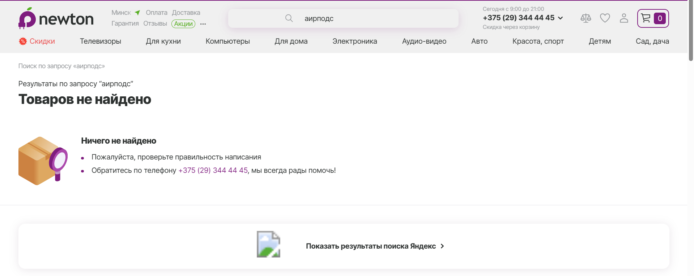

# Lab4

<strong>Заголовок:</strong> Поиск товара “Apple Airpods 3” по некорректным данным 
<strong>Предусловие:</strong> Открыта главная страница сайта https://newton.by/, я не знаю английский язык, поэтому буду искать “Аирподс 3” 
<strong>Шаги:</strong> 
1. Перейти на сайт https://newton.by/
2. Ввести в поле поиска значение “Аирподс 3” 
3. Нажать enter для подтверждения поиска

<strong>Ожидаемый результат:</strong> Переход на страницу с аналогичными товарами 
 
<strong>Фактические результаты: </strong> Товар не найден 
<strong>Статус: </strong> Провал 

<strong>Заголовок:</strong> Добавление товара в избранное 
<strong>Предусловие:</strong> Для того, чтобы у пользователя были сохранены все товары в избранном, он должен быть зарегистрирован и авторизован в личном кабинете 
<strong>Шаги:</strong> 
1. Перейти на сайт https://newton.by/
2. Посредствам поиска и/или панели "рекомендуем" найти необходимые товары
3. Выбрать необходимый товар
4. Открыть товар (или не открывать)
5. Нажать на символ “Сердечко”

<strong>Ожидаемый результат:</strong> Товар добавился в панель "Избранное", в верхней навигационной панели сердечко загорелось красным цветом 
<strong>Фактические результаты: </strong> Как ожидаемый 
 
<strong>Статус: </strong> Пройден 

<strong>Заголовок:</strong> Регистрация 
<strong>Предусловие:</strong> Для того, чтобы у пользователя был личный кабинет он должен пройти регистрацию 
<strong>Шаги:</strong> 
1. Перейти на сайт https://newton.by/
2. Нажать на значок профиля в верхнем правом углу 
3. Выбрать "Регистрация"
4. Заполнить соответсвующие поля
5. Нажать на кнопку "Регистрация"

<strong>Ожидаемый результат:</strong> Пользователь пройдет регистрация 
<strong>Фактические результаты: </strong> Как ожидаемый 
 
<strong>Статус: </strong> Пройден 

<strong>Заголовок:</strong> Добавление в корзину 
<strong>Предусловие:</strong> Для оформления товаров их нужно добавить в корзину 
<strong>Шаги:</strong> 
1. Перейти на сайт https://newton.by/
2. Посредствам поиска и/или панели "рекомендуем" найти необходимые товары 
3. Выбрать необходимый товар
4. Открыть товар (или не открывать)
5. Нажать на символ “Корзина”

<strong>Ожидаемый результат:</strong> Пользователь довабит товар в корзину, в правом верхнем углу количество товаров в корзине увеличится на один 
<strong>Фактические результаты: </strong> Как ожидаемый 
 
<strong>Статус: </strong> Пройден 

